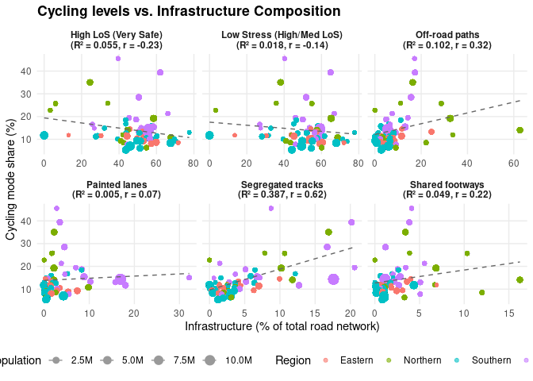

# Preliminary cycling infra vs usage analysis


## Introduction

- Aim: examine which cycling-infrastructure metrics align best with
  cycling use.

- Start with simple measures (total km, km per 1 000 people) –
  foundation for later work on network characteristics.

## Data and methods

- Cycling infrastructure from OSM, `osmactive` R package. We classified
  infrastructure into distinct categories using the
  `classify_cycle_infrastructure` function, which considers OSM tags
  (e.g., `highway`, `cycleway`, `segregated`) and geometry (e.g.,
  distance to the nearest road) to distinguish between:

  - **Segregated tracks:** Physically separated from motor traffic
    (further split into wide $\ge$ 2m and narrow \< 2m).
  - **Off-road paths:** Paths away from the road network (e.g., through
    parks).
  - **Painted lanes:** Marked lanes on the carriageway without physical
    separation.
  - **Shared footways:** Paths shared with pedestrians.
  - **Mixed traffic:** Cycling on the carriageway with motor traffic
    (not counted as dedicated infrastructure).

- Cycling use from [the EU Quality of Life
  Survey](https://ec.europa.eu/regional_policy/information-sources/maps/quality-of-life_en).
  83 cities, ≈ 70,000 respondents; includes a transport question (“On a
  typical day, which mode(s) of transport do you use most often?” ),
  where cycling is one of the selectable modes (up to two choices
  allowed), providing a simple city-level proxy for cycling use. There
  are previous editions.

- Create exploratory scatter plots to see associations.

<!-- ### Potential cycling-use datasets -->

<!-- - **Eurostat: journeys to work by bicycle**   -->

<!--   Patchy coverage, many cities missing.   -->

<!--   https://ec.europa.eu/eurostat/databrowser/view/urb_ctran__custom_18909106/default/table -->

<!-- - **Bicycle counter data (Kraus and Koch, PNAS)**   -->

<!--   Only for cities with counters.   -->

<!--   https://www.pnas.org/doi/10.1073/pnas.2024399118   -->

<!--   Data: https://zenodo.org/records/4015974 -->

<!-- - **Cycling mode share in 864 European cities (Sobral et al.)**   -->

<!--   Interesting working project, modelled values.   -->

<!--   https://www.cyclingandsociety.org/wp-content/uploads/2025/09/CyclingAndSociety2025-4-Sobral.pdf -->

<!-- - **Quality of Life in European Cities survey (DG REGIO)**   -->

<!--   83 cities, >70,000 respondents; includes question   -->

<!--   “On a typical day, which mode(s) do you use most often? Bicycle”.   -->

<!--   https://ec.europa.eu/regional_policy/information-sources/maps/quality-of-life_en -->

<!-- *the QoL survey seems to provide the most consistent city-level cycling-use indicator across many cities. IS 83 sample enough?* -->

``` r
# Test the classification logic on a small country/city (Monaco)
message("Running classification test for Monaco...")
# We use try() to allow the document to render even if the test fails (e.g. internet issues)
test_result <- try({
  get_city_metrics("Monaco", "Monaco")
}, silent = TRUE)

if (inherits(test_result, "try-error")) {
  message("Test failed: ", conditionMessage(attr(test_result, "condition")))
} else {
  print(test_result)
}
```

## Results

<div id="fig-infra-usage-types-1">

| Infrastructure Type | correlation | R-squared | Number of Cities | label_text |
|:---|---:|---:|---:|:---|
| Segregated tracks | 0.6217974 | 0.387 | 62 | Segregated tracks |
| (R² = 0.387, r = 0.62) |  |  |  |  |
| Segregated tracks | 0.6217974 | 0.387 | 62 | Segregated tracks |
| (R² = 0.387, r = 0.62) |  |  |  |  |
| Segregated tracks | 0.6217974 | 0.387 | 62 | Segregated tracks |
| (R² = 0.387, r = 0.62) |  |  |  |  |
| Segregated tracks | 0.6217974 | 0.387 | 62 | Segregated tracks |
| (R² = 0.387, r = 0.62) |  |  |  |  |
| Segregated tracks | 0.6217974 | 0.387 | 62 | Segregated tracks |
| (R² = 0.387, r = 0.62) |  |  |  |  |
| Segregated tracks | 0.6217974 | 0.387 | 62 | Segregated tracks |
| (R² = 0.387, r = 0.62) |  |  |  |  |
| Segregated tracks | 0.6217974 | 0.387 | 62 | Segregated tracks |
| (R² = 0.387, r = 0.62) |  |  |  |  |
| Segregated tracks | 0.6217974 | 0.387 | 62 | Segregated tracks |
| (R² = 0.387, r = 0.62) |  |  |  |  |
| Segregated tracks | 0.6217974 | 0.387 | 62 | Segregated tracks |
| (R² = 0.387, r = 0.62) |  |  |  |  |
| Segregated tracks | 0.6217974 | 0.387 | 62 | Segregated tracks |
| (R² = 0.387, r = 0.62) |  |  |  |  |
| Segregated tracks | 0.6217974 | 0.387 | 62 | Segregated tracks |
| (R² = 0.387, r = 0.62) |  |  |  |  |
| Segregated tracks | 0.6217974 | 0.387 | 62 | Segregated tracks |
| (R² = 0.387, r = 0.62) |  |  |  |  |
| Segregated tracks | 0.6217974 | 0.387 | 62 | Segregated tracks |
| (R² = 0.387, r = 0.62) |  |  |  |  |
| Segregated tracks | 0.6217974 | 0.387 | 62 | Segregated tracks |
| (R² = 0.387, r = 0.62) |  |  |  |  |
| Segregated tracks | 0.6217974 | 0.387 | 62 | Segregated tracks |
| (R² = 0.387, r = 0.62) |  |  |  |  |
| Segregated tracks | 0.6217974 | 0.387 | 62 | Segregated tracks |
| (R² = 0.387, r = 0.62) |  |  |  |  |
| Segregated tracks | 0.6217974 | 0.387 | 62 | Segregated tracks |
| (R² = 0.387, r = 0.62) |  |  |  |  |
| Segregated tracks | 0.6217974 | 0.387 | 62 | Segregated tracks |
| (R² = 0.387, r = 0.62) |  |  |  |  |
| Segregated tracks | 0.6217974 | 0.387 | 62 | Segregated tracks |
| (R² = 0.387, r = 0.62) |  |  |  |  |
| Segregated tracks | 0.6217974 | 0.387 | 62 | Segregated tracks |
| (R² = 0.387, r = 0.62) |  |  |  |  |
| Segregated tracks | 0.6217974 | 0.387 | 62 | Segregated tracks |
| (R² = 0.387, r = 0.62) |  |  |  |  |
| Segregated tracks | 0.6217974 | 0.387 | 62 | Segregated tracks |
| (R² = 0.387, r = 0.62) |  |  |  |  |
| Segregated tracks | 0.6217974 | 0.387 | 62 | Segregated tracks |
| (R² = 0.387, r = 0.62) |  |  |  |  |
| Segregated tracks | 0.6217974 | 0.387 | 62 | Segregated tracks |
| (R² = 0.387, r = 0.62) |  |  |  |  |
| Segregated tracks | 0.6217974 | 0.387 | 62 | Segregated tracks |
| (R² = 0.387, r = 0.62) |  |  |  |  |
| Segregated tracks | 0.6217974 | 0.387 | 62 | Segregated tracks |
| (R² = 0.387, r = 0.62) |  |  |  |  |
| Segregated tracks | 0.6217974 | 0.387 | 62 | Segregated tracks |
| (R² = 0.387, r = 0.62) |  |  |  |  |
| Segregated tracks | 0.6217974 | 0.387 | 62 | Segregated tracks |
| (R² = 0.387, r = 0.62) |  |  |  |  |
| Segregated tracks | 0.6217974 | 0.387 | 62 | Segregated tracks |
| (R² = 0.387, r = 0.62) |  |  |  |  |
| Segregated tracks | 0.6217974 | 0.387 | 62 | Segregated tracks |
| (R² = 0.387, r = 0.62) |  |  |  |  |
| Segregated tracks | 0.6217974 | 0.387 | 62 | Segregated tracks |
| (R² = 0.387, r = 0.62) |  |  |  |  |
| Segregated tracks | 0.6217974 | 0.387 | 62 | Segregated tracks |
| (R² = 0.387, r = 0.62) |  |  |  |  |
| Segregated tracks | 0.6217974 | 0.387 | 62 | Segregated tracks |
| (R² = 0.387, r = 0.62) |  |  |  |  |
| Segregated tracks | 0.6217974 | 0.387 | 62 | Segregated tracks |
| (R² = 0.387, r = 0.62) |  |  |  |  |
| Segregated tracks | 0.6217974 | 0.387 | 62 | Segregated tracks |
| (R² = 0.387, r = 0.62) |  |  |  |  |
| Segregated tracks | 0.6217974 | 0.387 | 62 | Segregated tracks |
| (R² = 0.387, r = 0.62) |  |  |  |  |
| Segregated tracks | 0.6217974 | 0.387 | 62 | Segregated tracks |
| (R² = 0.387, r = 0.62) |  |  |  |  |
| Segregated tracks | 0.6217974 | 0.387 | 62 | Segregated tracks |
| (R² = 0.387, r = 0.62) |  |  |  |  |
| Segregated tracks | 0.6217974 | 0.387 | 62 | Segregated tracks |
| (R² = 0.387, r = 0.62) |  |  |  |  |
| Segregated tracks | 0.6217974 | 0.387 | 62 | Segregated tracks |
| (R² = 0.387, r = 0.62) |  |  |  |  |
| Segregated tracks | 0.6217974 | 0.387 | 62 | Segregated tracks |
| (R² = 0.387, r = 0.62) |  |  |  |  |
| Segregated tracks | 0.6217974 | 0.387 | 62 | Segregated tracks |
| (R² = 0.387, r = 0.62) |  |  |  |  |
| Segregated tracks | 0.6217974 | 0.387 | 62 | Segregated tracks |
| (R² = 0.387, r = 0.62) |  |  |  |  |
| Segregated tracks | 0.6217974 | 0.387 | 62 | Segregated tracks |
| (R² = 0.387, r = 0.62) |  |  |  |  |
| Segregated tracks | 0.6217974 | 0.387 | 62 | Segregated tracks |
| (R² = 0.387, r = 0.62) |  |  |  |  |
| Segregated tracks | 0.6217974 | 0.387 | 62 | Segregated tracks |
| (R² = 0.387, r = 0.62) |  |  |  |  |
| Segregated tracks | 0.6217974 | 0.387 | 62 | Segregated tracks |
| (R² = 0.387, r = 0.62) |  |  |  |  |
| Segregated tracks | 0.6217974 | 0.387 | 62 | Segregated tracks |
| (R² = 0.387, r = 0.62) |  |  |  |  |
| Segregated tracks | 0.6217974 | 0.387 | 62 | Segregated tracks |
| (R² = 0.387, r = 0.62) |  |  |  |  |
| Segregated tracks | 0.6217974 | 0.387 | 62 | Segregated tracks |
| (R² = 0.387, r = 0.62) |  |  |  |  |
| Segregated tracks | 0.6217974 | 0.387 | 62 | Segregated tracks |
| (R² = 0.387, r = 0.62) |  |  |  |  |
| Segregated tracks | 0.6217974 | 0.387 | 62 | Segregated tracks |
| (R² = 0.387, r = 0.62) |  |  |  |  |
| Segregated tracks | 0.6217974 | 0.387 | 62 | Segregated tracks |
| (R² = 0.387, r = 0.62) |  |  |  |  |
| Segregated tracks | 0.6217974 | 0.387 | 62 | Segregated tracks |
| (R² = 0.387, r = 0.62) |  |  |  |  |
| Segregated tracks | 0.6217974 | 0.387 | 62 | Segregated tracks |
| (R² = 0.387, r = 0.62) |  |  |  |  |
| Segregated tracks | 0.6217974 | 0.387 | 62 | Segregated tracks |
| (R² = 0.387, r = 0.62) |  |  |  |  |
| Segregated tracks | 0.6217974 | 0.387 | 62 | Segregated tracks |
| (R² = 0.387, r = 0.62) |  |  |  |  |
| Segregated tracks | 0.6217974 | 0.387 | 62 | Segregated tracks |
| (R² = 0.387, r = 0.62) |  |  |  |  |
| Segregated tracks | 0.6217974 | 0.387 | 62 | Segregated tracks |
| (R² = 0.387, r = 0.62) |  |  |  |  |
| Segregated tracks | 0.6217974 | 0.387 | 62 | Segregated tracks |
| (R² = 0.387, r = 0.62) |  |  |  |  |
| Segregated tracks | 0.6217974 | 0.387 | 62 | Segregated tracks |
| (R² = 0.387, r = 0.62) |  |  |  |  |
| Segregated tracks | 0.6217974 | 0.387 | 62 | Segregated tracks |
| (R² = 0.387, r = 0.62) |  |  |  |  |
| Off-road paths | 0.3193822 | 0.102 | 61 | Off-road paths |
| (R² = 0.102, r = 0.32) |  |  |  |  |
| Off-road paths | 0.3193822 | 0.102 | 61 | Off-road paths |
| (R² = 0.102, r = 0.32) |  |  |  |  |
| Off-road paths | 0.3193822 | 0.102 | 61 | Off-road paths |
| (R² = 0.102, r = 0.32) |  |  |  |  |
| Off-road paths | 0.3193822 | 0.102 | 61 | Off-road paths |
| (R² = 0.102, r = 0.32) |  |  |  |  |
| Off-road paths | 0.3193822 | 0.102 | 61 | Off-road paths |
| (R² = 0.102, r = 0.32) |  |  |  |  |
| Off-road paths | 0.3193822 | 0.102 | 61 | Off-road paths |
| (R² = 0.102, r = 0.32) |  |  |  |  |
| Off-road paths | 0.3193822 | 0.102 | 61 | Off-road paths |
| (R² = 0.102, r = 0.32) |  |  |  |  |
| Off-road paths | 0.3193822 | 0.102 | 61 | Off-road paths |
| (R² = 0.102, r = 0.32) |  |  |  |  |
| Off-road paths | 0.3193822 | 0.102 | 61 | Off-road paths |
| (R² = 0.102, r = 0.32) |  |  |  |  |
| Off-road paths | 0.3193822 | 0.102 | 61 | Off-road paths |
| (R² = 0.102, r = 0.32) |  |  |  |  |
| Off-road paths | 0.3193822 | 0.102 | 61 | Off-road paths |
| (R² = 0.102, r = 0.32) |  |  |  |  |
| Off-road paths | 0.3193822 | 0.102 | 61 | Off-road paths |
| (R² = 0.102, r = 0.32) |  |  |  |  |
| Off-road paths | 0.3193822 | 0.102 | 61 | Off-road paths |
| (R² = 0.102, r = 0.32) |  |  |  |  |
| Off-road paths | 0.3193822 | 0.102 | 61 | Off-road paths |
| (R² = 0.102, r = 0.32) |  |  |  |  |
| Off-road paths | 0.3193822 | 0.102 | 61 | Off-road paths |
| (R² = 0.102, r = 0.32) |  |  |  |  |
| Off-road paths | 0.3193822 | 0.102 | 61 | Off-road paths |
| (R² = 0.102, r = 0.32) |  |  |  |  |
| Off-road paths | 0.3193822 | 0.102 | 61 | Off-road paths |
| (R² = 0.102, r = 0.32) |  |  |  |  |
| Off-road paths | 0.3193822 | 0.102 | 61 | Off-road paths |
| (R² = 0.102, r = 0.32) |  |  |  |  |
| Off-road paths | 0.3193822 | 0.102 | 61 | Off-road paths |
| (R² = 0.102, r = 0.32) |  |  |  |  |
| Off-road paths | 0.3193822 | 0.102 | 61 | Off-road paths |
| (R² = 0.102, r = 0.32) |  |  |  |  |
| Off-road paths | 0.3193822 | 0.102 | 61 | Off-road paths |
| (R² = 0.102, r = 0.32) |  |  |  |  |
| Off-road paths | 0.3193822 | 0.102 | 61 | Off-road paths |
| (R² = 0.102, r = 0.32) |  |  |  |  |
| Off-road paths | 0.3193822 | 0.102 | 61 | Off-road paths |
| (R² = 0.102, r = 0.32) |  |  |  |  |
| Off-road paths | 0.3193822 | 0.102 | 61 | Off-road paths |
| (R² = 0.102, r = 0.32) |  |  |  |  |
| Off-road paths | 0.3193822 | 0.102 | 61 | Off-road paths |
| (R² = 0.102, r = 0.32) |  |  |  |  |
| Off-road paths | 0.3193822 | 0.102 | 61 | Off-road paths |
| (R² = 0.102, r = 0.32) |  |  |  |  |
| Off-road paths | 0.3193822 | 0.102 | 61 | Off-road paths |
| (R² = 0.102, r = 0.32) |  |  |  |  |
| Off-road paths | 0.3193822 | 0.102 | 61 | Off-road paths |
| (R² = 0.102, r = 0.32) |  |  |  |  |
| Off-road paths | 0.3193822 | 0.102 | 61 | Off-road paths |
| (R² = 0.102, r = 0.32) |  |  |  |  |
| Off-road paths | 0.3193822 | 0.102 | 61 | Off-road paths |
| (R² = 0.102, r = 0.32) |  |  |  |  |
| Off-road paths | 0.3193822 | 0.102 | 61 | Off-road paths |
| (R² = 0.102, r = 0.32) |  |  |  |  |
| Off-road paths | 0.3193822 | 0.102 | 61 | Off-road paths |
| (R² = 0.102, r = 0.32) |  |  |  |  |
| Off-road paths | 0.3193822 | 0.102 | 61 | Off-road paths |
| (R² = 0.102, r = 0.32) |  |  |  |  |
| Off-road paths | 0.3193822 | 0.102 | 61 | Off-road paths |
| (R² = 0.102, r = 0.32) |  |  |  |  |
| Off-road paths | 0.3193822 | 0.102 | 61 | Off-road paths |
| (R² = 0.102, r = 0.32) |  |  |  |  |
| Off-road paths | 0.3193822 | 0.102 | 61 | Off-road paths |
| (R² = 0.102, r = 0.32) |  |  |  |  |
| Off-road paths | 0.3193822 | 0.102 | 61 | Off-road paths |
| (R² = 0.102, r = 0.32) |  |  |  |  |
| Off-road paths | 0.3193822 | 0.102 | 61 | Off-road paths |
| (R² = 0.102, r = 0.32) |  |  |  |  |
| Off-road paths | 0.3193822 | 0.102 | 61 | Off-road paths |
| (R² = 0.102, r = 0.32) |  |  |  |  |
| Off-road paths | 0.3193822 | 0.102 | 61 | Off-road paths |
| (R² = 0.102, r = 0.32) |  |  |  |  |
| Off-road paths | 0.3193822 | 0.102 | 61 | Off-road paths |
| (R² = 0.102, r = 0.32) |  |  |  |  |
| Off-road paths | 0.3193822 | 0.102 | 61 | Off-road paths |
| (R² = 0.102, r = 0.32) |  |  |  |  |
| Off-road paths | 0.3193822 | 0.102 | 61 | Off-road paths |
| (R² = 0.102, r = 0.32) |  |  |  |  |
| Off-road paths | 0.3193822 | 0.102 | 61 | Off-road paths |
| (R² = 0.102, r = 0.32) |  |  |  |  |
| Off-road paths | 0.3193822 | 0.102 | 61 | Off-road paths |
| (R² = 0.102, r = 0.32) |  |  |  |  |
| Off-road paths | 0.3193822 | 0.102 | 61 | Off-road paths |
| (R² = 0.102, r = 0.32) |  |  |  |  |
| Off-road paths | 0.3193822 | 0.102 | 61 | Off-road paths |
| (R² = 0.102, r = 0.32) |  |  |  |  |
| Off-road paths | 0.3193822 | 0.102 | 61 | Off-road paths |
| (R² = 0.102, r = 0.32) |  |  |  |  |
| Off-road paths | 0.3193822 | 0.102 | 61 | Off-road paths |
| (R² = 0.102, r = 0.32) |  |  |  |  |
| Off-road paths | 0.3193822 | 0.102 | 61 | Off-road paths |
| (R² = 0.102, r = 0.32) |  |  |  |  |
| Off-road paths | 0.3193822 | 0.102 | 61 | Off-road paths |
| (R² = 0.102, r = 0.32) |  |  |  |  |
| Off-road paths | 0.3193822 | 0.102 | 61 | Off-road paths |
| (R² = 0.102, r = 0.32) |  |  |  |  |
| Off-road paths | 0.3193822 | 0.102 | 61 | Off-road paths |
| (R² = 0.102, r = 0.32) |  |  |  |  |
| Off-road paths | 0.3193822 | 0.102 | 61 | Off-road paths |
| (R² = 0.102, r = 0.32) |  |  |  |  |
| Off-road paths | 0.3193822 | 0.102 | 61 | Off-road paths |
| (R² = 0.102, r = 0.32) |  |  |  |  |
| Off-road paths | 0.3193822 | 0.102 | 61 | Off-road paths |
| (R² = 0.102, r = 0.32) |  |  |  |  |
| Off-road paths | 0.3193822 | 0.102 | 61 | Off-road paths |
| (R² = 0.102, r = 0.32) |  |  |  |  |
| Off-road paths | 0.3193822 | 0.102 | 61 | Off-road paths |
| (R² = 0.102, r = 0.32) |  |  |  |  |
| Off-road paths | 0.3193822 | 0.102 | 61 | Off-road paths |
| (R² = 0.102, r = 0.32) |  |  |  |  |
| Off-road paths | 0.3193822 | 0.102 | 61 | Off-road paths |
| (R² = 0.102, r = 0.32) |  |  |  |  |
| Off-road paths | 0.3193822 | 0.102 | 61 | Off-road paths |
| (R² = 0.102, r = 0.32) |  |  |  |  |
| Painted lanes | 0.0679166 | 0.005 | 62 | Painted lanes |
| (R² = 0.005, r = 0.07) |  |  |  |  |
| Painted lanes | 0.0679166 | 0.005 | 62 | Painted lanes |
| (R² = 0.005, r = 0.07) |  |  |  |  |
| Painted lanes | 0.0679166 | 0.005 | 62 | Painted lanes |
| (R² = 0.005, r = 0.07) |  |  |  |  |
| Painted lanes | 0.0679166 | 0.005 | 62 | Painted lanes |
| (R² = 0.005, r = 0.07) |  |  |  |  |
| Painted lanes | 0.0679166 | 0.005 | 62 | Painted lanes |
| (R² = 0.005, r = 0.07) |  |  |  |  |
| Painted lanes | 0.0679166 | 0.005 | 62 | Painted lanes |
| (R² = 0.005, r = 0.07) |  |  |  |  |
| Painted lanes | 0.0679166 | 0.005 | 62 | Painted lanes |
| (R² = 0.005, r = 0.07) |  |  |  |  |
| Painted lanes | 0.0679166 | 0.005 | 62 | Painted lanes |
| (R² = 0.005, r = 0.07) |  |  |  |  |
| Painted lanes | 0.0679166 | 0.005 | 62 | Painted lanes |
| (R² = 0.005, r = 0.07) |  |  |  |  |
| Painted lanes | 0.0679166 | 0.005 | 62 | Painted lanes |
| (R² = 0.005, r = 0.07) |  |  |  |  |
| Painted lanes | 0.0679166 | 0.005 | 62 | Painted lanes |
| (R² = 0.005, r = 0.07) |  |  |  |  |
| Painted lanes | 0.0679166 | 0.005 | 62 | Painted lanes |
| (R² = 0.005, r = 0.07) |  |  |  |  |
| Painted lanes | 0.0679166 | 0.005 | 62 | Painted lanes |
| (R² = 0.005, r = 0.07) |  |  |  |  |
| Painted lanes | 0.0679166 | 0.005 | 62 | Painted lanes |
| (R² = 0.005, r = 0.07) |  |  |  |  |
| Painted lanes | 0.0679166 | 0.005 | 62 | Painted lanes |
| (R² = 0.005, r = 0.07) |  |  |  |  |
| Painted lanes | 0.0679166 | 0.005 | 62 | Painted lanes |
| (R² = 0.005, r = 0.07) |  |  |  |  |
| Painted lanes | 0.0679166 | 0.005 | 62 | Painted lanes |
| (R² = 0.005, r = 0.07) |  |  |  |  |
| Painted lanes | 0.0679166 | 0.005 | 62 | Painted lanes |
| (R² = 0.005, r = 0.07) |  |  |  |  |
| Painted lanes | 0.0679166 | 0.005 | 62 | Painted lanes |
| (R² = 0.005, r = 0.07) |  |  |  |  |
| Painted lanes | 0.0679166 | 0.005 | 62 | Painted lanes |
| (R² = 0.005, r = 0.07) |  |  |  |  |
| Painted lanes | 0.0679166 | 0.005 | 62 | Painted lanes |
| (R² = 0.005, r = 0.07) |  |  |  |  |
| Painted lanes | 0.0679166 | 0.005 | 62 | Painted lanes |
| (R² = 0.005, r = 0.07) |  |  |  |  |
| Painted lanes | 0.0679166 | 0.005 | 62 | Painted lanes |
| (R² = 0.005, r = 0.07) |  |  |  |  |
| Painted lanes | 0.0679166 | 0.005 | 62 | Painted lanes |
| (R² = 0.005, r = 0.07) |  |  |  |  |
| Painted lanes | 0.0679166 | 0.005 | 62 | Painted lanes |
| (R² = 0.005, r = 0.07) |  |  |  |  |
| Painted lanes | 0.0679166 | 0.005 | 62 | Painted lanes |
| (R² = 0.005, r = 0.07) |  |  |  |  |
| Painted lanes | 0.0679166 | 0.005 | 62 | Painted lanes |
| (R² = 0.005, r = 0.07) |  |  |  |  |
| Painted lanes | 0.0679166 | 0.005 | 62 | Painted lanes |
| (R² = 0.005, r = 0.07) |  |  |  |  |
| Painted lanes | 0.0679166 | 0.005 | 62 | Painted lanes |
| (R² = 0.005, r = 0.07) |  |  |  |  |
| Painted lanes | 0.0679166 | 0.005 | 62 | Painted lanes |
| (R² = 0.005, r = 0.07) |  |  |  |  |
| Painted lanes | 0.0679166 | 0.005 | 62 | Painted lanes |
| (R² = 0.005, r = 0.07) |  |  |  |  |
| Painted lanes | 0.0679166 | 0.005 | 62 | Painted lanes |
| (R² = 0.005, r = 0.07) |  |  |  |  |
| Painted lanes | 0.0679166 | 0.005 | 62 | Painted lanes |
| (R² = 0.005, r = 0.07) |  |  |  |  |
| Painted lanes | 0.0679166 | 0.005 | 62 | Painted lanes |
| (R² = 0.005, r = 0.07) |  |  |  |  |
| Painted lanes | 0.0679166 | 0.005 | 62 | Painted lanes |
| (R² = 0.005, r = 0.07) |  |  |  |  |
| Painted lanes | 0.0679166 | 0.005 | 62 | Painted lanes |
| (R² = 0.005, r = 0.07) |  |  |  |  |
| Painted lanes | 0.0679166 | 0.005 | 62 | Painted lanes |
| (R² = 0.005, r = 0.07) |  |  |  |  |
| Painted lanes | 0.0679166 | 0.005 | 62 | Painted lanes |
| (R² = 0.005, r = 0.07) |  |  |  |  |
| Painted lanes | 0.0679166 | 0.005 | 62 | Painted lanes |
| (R² = 0.005, r = 0.07) |  |  |  |  |
| Painted lanes | 0.0679166 | 0.005 | 62 | Painted lanes |
| (R² = 0.005, r = 0.07) |  |  |  |  |
| Painted lanes | 0.0679166 | 0.005 | 62 | Painted lanes |
| (R² = 0.005, r = 0.07) |  |  |  |  |
| Painted lanes | 0.0679166 | 0.005 | 62 | Painted lanes |
| (R² = 0.005, r = 0.07) |  |  |  |  |
| Painted lanes | 0.0679166 | 0.005 | 62 | Painted lanes |
| (R² = 0.005, r = 0.07) |  |  |  |  |
| Painted lanes | 0.0679166 | 0.005 | 62 | Painted lanes |
| (R² = 0.005, r = 0.07) |  |  |  |  |
| Painted lanes | 0.0679166 | 0.005 | 62 | Painted lanes |
| (R² = 0.005, r = 0.07) |  |  |  |  |
| Painted lanes | 0.0679166 | 0.005 | 62 | Painted lanes |
| (R² = 0.005, r = 0.07) |  |  |  |  |
| Painted lanes | 0.0679166 | 0.005 | 62 | Painted lanes |
| (R² = 0.005, r = 0.07) |  |  |  |  |
| Painted lanes | 0.0679166 | 0.005 | 62 | Painted lanes |
| (R² = 0.005, r = 0.07) |  |  |  |  |
| Painted lanes | 0.0679166 | 0.005 | 62 | Painted lanes |
| (R² = 0.005, r = 0.07) |  |  |  |  |
| Painted lanes | 0.0679166 | 0.005 | 62 | Painted lanes |
| (R² = 0.005, r = 0.07) |  |  |  |  |
| Painted lanes | 0.0679166 | 0.005 | 62 | Painted lanes |
| (R² = 0.005, r = 0.07) |  |  |  |  |
| Painted lanes | 0.0679166 | 0.005 | 62 | Painted lanes |
| (R² = 0.005, r = 0.07) |  |  |  |  |
| Painted lanes | 0.0679166 | 0.005 | 62 | Painted lanes |
| (R² = 0.005, r = 0.07) |  |  |  |  |
| Painted lanes | 0.0679166 | 0.005 | 62 | Painted lanes |
| (R² = 0.005, r = 0.07) |  |  |  |  |
| Painted lanes | 0.0679166 | 0.005 | 62 | Painted lanes |
| (R² = 0.005, r = 0.07) |  |  |  |  |
| Painted lanes | 0.0679166 | 0.005 | 62 | Painted lanes |
| (R² = 0.005, r = 0.07) |  |  |  |  |
| Painted lanes | 0.0679166 | 0.005 | 62 | Painted lanes |
| (R² = 0.005, r = 0.07) |  |  |  |  |
| Painted lanes | 0.0679166 | 0.005 | 62 | Painted lanes |
| (R² = 0.005, r = 0.07) |  |  |  |  |
| Painted lanes | 0.0679166 | 0.005 | 62 | Painted lanes |
| (R² = 0.005, r = 0.07) |  |  |  |  |
| Painted lanes | 0.0679166 | 0.005 | 62 | Painted lanes |
| (R² = 0.005, r = 0.07) |  |  |  |  |
| Painted lanes | 0.0679166 | 0.005 | 62 | Painted lanes |
| (R² = 0.005, r = 0.07) |  |  |  |  |
| Painted lanes | 0.0679166 | 0.005 | 62 | Painted lanes |
| (R² = 0.005, r = 0.07) |  |  |  |  |
| Shared footways | 0.2222535 | 0.049 | 62 | Shared footways |
| (R² = 0.049, r = 0.22) |  |  |  |  |
| Shared footways | 0.2222535 | 0.049 | 62 | Shared footways |
| (R² = 0.049, r = 0.22) |  |  |  |  |
| Shared footways | 0.2222535 | 0.049 | 62 | Shared footways |
| (R² = 0.049, r = 0.22) |  |  |  |  |
| Shared footways | 0.2222535 | 0.049 | 62 | Shared footways |
| (R² = 0.049, r = 0.22) |  |  |  |  |
| Shared footways | 0.2222535 | 0.049 | 62 | Shared footways |
| (R² = 0.049, r = 0.22) |  |  |  |  |
| Shared footways | 0.2222535 | 0.049 | 62 | Shared footways |
| (R² = 0.049, r = 0.22) |  |  |  |  |
| Shared footways | 0.2222535 | 0.049 | 62 | Shared footways |
| (R² = 0.049, r = 0.22) |  |  |  |  |
| Shared footways | 0.2222535 | 0.049 | 62 | Shared footways |
| (R² = 0.049, r = 0.22) |  |  |  |  |
| Shared footways | 0.2222535 | 0.049 | 62 | Shared footways |
| (R² = 0.049, r = 0.22) |  |  |  |  |
| Shared footways | 0.2222535 | 0.049 | 62 | Shared footways |
| (R² = 0.049, r = 0.22) |  |  |  |  |
| Shared footways | 0.2222535 | 0.049 | 62 | Shared footways |
| (R² = 0.049, r = 0.22) |  |  |  |  |
| Shared footways | 0.2222535 | 0.049 | 62 | Shared footways |
| (R² = 0.049, r = 0.22) |  |  |  |  |
| Shared footways | 0.2222535 | 0.049 | 62 | Shared footways |
| (R² = 0.049, r = 0.22) |  |  |  |  |
| Shared footways | 0.2222535 | 0.049 | 62 | Shared footways |
| (R² = 0.049, r = 0.22) |  |  |  |  |
| Shared footways | 0.2222535 | 0.049 | 62 | Shared footways |
| (R² = 0.049, r = 0.22) |  |  |  |  |
| Shared footways | 0.2222535 | 0.049 | 62 | Shared footways |
| (R² = 0.049, r = 0.22) |  |  |  |  |
| Shared footways | 0.2222535 | 0.049 | 62 | Shared footways |
| (R² = 0.049, r = 0.22) |  |  |  |  |
| Shared footways | 0.2222535 | 0.049 | 62 | Shared footways |
| (R² = 0.049, r = 0.22) |  |  |  |  |
| Shared footways | 0.2222535 | 0.049 | 62 | Shared footways |
| (R² = 0.049, r = 0.22) |  |  |  |  |
| Shared footways | 0.2222535 | 0.049 | 62 | Shared footways |
| (R² = 0.049, r = 0.22) |  |  |  |  |
| Shared footways | 0.2222535 | 0.049 | 62 | Shared footways |
| (R² = 0.049, r = 0.22) |  |  |  |  |
| Shared footways | 0.2222535 | 0.049 | 62 | Shared footways |
| (R² = 0.049, r = 0.22) |  |  |  |  |
| Shared footways | 0.2222535 | 0.049 | 62 | Shared footways |
| (R² = 0.049, r = 0.22) |  |  |  |  |
| Shared footways | 0.2222535 | 0.049 | 62 | Shared footways |
| (R² = 0.049, r = 0.22) |  |  |  |  |
| Shared footways | 0.2222535 | 0.049 | 62 | Shared footways |
| (R² = 0.049, r = 0.22) |  |  |  |  |
| Shared footways | 0.2222535 | 0.049 | 62 | Shared footways |
| (R² = 0.049, r = 0.22) |  |  |  |  |
| Shared footways | 0.2222535 | 0.049 | 62 | Shared footways |
| (R² = 0.049, r = 0.22) |  |  |  |  |
| Shared footways | 0.2222535 | 0.049 | 62 | Shared footways |
| (R² = 0.049, r = 0.22) |  |  |  |  |
| Shared footways | 0.2222535 | 0.049 | 62 | Shared footways |
| (R² = 0.049, r = 0.22) |  |  |  |  |
| Shared footways | 0.2222535 | 0.049 | 62 | Shared footways |
| (R² = 0.049, r = 0.22) |  |  |  |  |
| Shared footways | 0.2222535 | 0.049 | 62 | Shared footways |
| (R² = 0.049, r = 0.22) |  |  |  |  |
| Shared footways | 0.2222535 | 0.049 | 62 | Shared footways |
| (R² = 0.049, r = 0.22) |  |  |  |  |
| Shared footways | 0.2222535 | 0.049 | 62 | Shared footways |
| (R² = 0.049, r = 0.22) |  |  |  |  |
| Shared footways | 0.2222535 | 0.049 | 62 | Shared footways |
| (R² = 0.049, r = 0.22) |  |  |  |  |
| Shared footways | 0.2222535 | 0.049 | 62 | Shared footways |
| (R² = 0.049, r = 0.22) |  |  |  |  |
| Shared footways | 0.2222535 | 0.049 | 62 | Shared footways |
| (R² = 0.049, r = 0.22) |  |  |  |  |
| Shared footways | 0.2222535 | 0.049 | 62 | Shared footways |
| (R² = 0.049, r = 0.22) |  |  |  |  |
| Shared footways | 0.2222535 | 0.049 | 62 | Shared footways |
| (R² = 0.049, r = 0.22) |  |  |  |  |
| Shared footways | 0.2222535 | 0.049 | 62 | Shared footways |
| (R² = 0.049, r = 0.22) |  |  |  |  |
| Shared footways | 0.2222535 | 0.049 | 62 | Shared footways |
| (R² = 0.049, r = 0.22) |  |  |  |  |
| Shared footways | 0.2222535 | 0.049 | 62 | Shared footways |
| (R² = 0.049, r = 0.22) |  |  |  |  |
| Shared footways | 0.2222535 | 0.049 | 62 | Shared footways |
| (R² = 0.049, r = 0.22) |  |  |  |  |
| Shared footways | 0.2222535 | 0.049 | 62 | Shared footways |
| (R² = 0.049, r = 0.22) |  |  |  |  |
| Shared footways | 0.2222535 | 0.049 | 62 | Shared footways |
| (R² = 0.049, r = 0.22) |  |  |  |  |
| Shared footways | 0.2222535 | 0.049 | 62 | Shared footways |
| (R² = 0.049, r = 0.22) |  |  |  |  |
| Shared footways | 0.2222535 | 0.049 | 62 | Shared footways |
| (R² = 0.049, r = 0.22) |  |  |  |  |
| Shared footways | 0.2222535 | 0.049 | 62 | Shared footways |
| (R² = 0.049, r = 0.22) |  |  |  |  |
| Shared footways | 0.2222535 | 0.049 | 62 | Shared footways |
| (R² = 0.049, r = 0.22) |  |  |  |  |
| Shared footways | 0.2222535 | 0.049 | 62 | Shared footways |
| (R² = 0.049, r = 0.22) |  |  |  |  |
| Shared footways | 0.2222535 | 0.049 | 62 | Shared footways |
| (R² = 0.049, r = 0.22) |  |  |  |  |
| Shared footways | 0.2222535 | 0.049 | 62 | Shared footways |
| (R² = 0.049, r = 0.22) |  |  |  |  |
| Shared footways | 0.2222535 | 0.049 | 62 | Shared footways |
| (R² = 0.049, r = 0.22) |  |  |  |  |
| Shared footways | 0.2222535 | 0.049 | 62 | Shared footways |
| (R² = 0.049, r = 0.22) |  |  |  |  |
| Shared footways | 0.2222535 | 0.049 | 62 | Shared footways |
| (R² = 0.049, r = 0.22) |  |  |  |  |
| Shared footways | 0.2222535 | 0.049 | 62 | Shared footways |
| (R² = 0.049, r = 0.22) |  |  |  |  |
| Shared footways | 0.2222535 | 0.049 | 62 | Shared footways |
| (R² = 0.049, r = 0.22) |  |  |  |  |
| Shared footways | 0.2222535 | 0.049 | 62 | Shared footways |
| (R² = 0.049, r = 0.22) |  |  |  |  |
| Shared footways | 0.2222535 | 0.049 | 62 | Shared footways |
| (R² = 0.049, r = 0.22) |  |  |  |  |
| Shared footways | 0.2222535 | 0.049 | 62 | Shared footways |
| (R² = 0.049, r = 0.22) |  |  |  |  |
| Shared footways | 0.2222535 | 0.049 | 62 | Shared footways |
| (R² = 0.049, r = 0.22) |  |  |  |  |
| Shared footways | 0.2222535 | 0.049 | 62 | Shared footways |
| (R² = 0.049, r = 0.22) |  |  |  |  |
| Shared footways | 0.2222535 | 0.049 | 62 | Shared footways |
| (R² = 0.049, r = 0.22) |  |  |  |  |
| High LoS (Very Safe) | -0.2337784 | 0.055 | 62 | High LoS (Very Safe) |
| (R² = 0.055, r = -0.23) |  |  |  |  |
| High LoS (Very Safe) | -0.2337784 | 0.055 | 62 | High LoS (Very Safe) |
| (R² = 0.055, r = -0.23) |  |  |  |  |
| High LoS (Very Safe) | -0.2337784 | 0.055 | 62 | High LoS (Very Safe) |
| (R² = 0.055, r = -0.23) |  |  |  |  |
| High LoS (Very Safe) | -0.2337784 | 0.055 | 62 | High LoS (Very Safe) |
| (R² = 0.055, r = -0.23) |  |  |  |  |
| High LoS (Very Safe) | -0.2337784 | 0.055 | 62 | High LoS (Very Safe) |
| (R² = 0.055, r = -0.23) |  |  |  |  |
| High LoS (Very Safe) | -0.2337784 | 0.055 | 62 | High LoS (Very Safe) |
| (R² = 0.055, r = -0.23) |  |  |  |  |
| High LoS (Very Safe) | -0.2337784 | 0.055 | 62 | High LoS (Very Safe) |
| (R² = 0.055, r = -0.23) |  |  |  |  |
| High LoS (Very Safe) | -0.2337784 | 0.055 | 62 | High LoS (Very Safe) |
| (R² = 0.055, r = -0.23) |  |  |  |  |
| High LoS (Very Safe) | -0.2337784 | 0.055 | 62 | High LoS (Very Safe) |
| (R² = 0.055, r = -0.23) |  |  |  |  |
| High LoS (Very Safe) | -0.2337784 | 0.055 | 62 | High LoS (Very Safe) |
| (R² = 0.055, r = -0.23) |  |  |  |  |
| High LoS (Very Safe) | -0.2337784 | 0.055 | 62 | High LoS (Very Safe) |
| (R² = 0.055, r = -0.23) |  |  |  |  |
| High LoS (Very Safe) | -0.2337784 | 0.055 | 62 | High LoS (Very Safe) |
| (R² = 0.055, r = -0.23) |  |  |  |  |
| High LoS (Very Safe) | -0.2337784 | 0.055 | 62 | High LoS (Very Safe) |
| (R² = 0.055, r = -0.23) |  |  |  |  |
| High LoS (Very Safe) | -0.2337784 | 0.055 | 62 | High LoS (Very Safe) |
| (R² = 0.055, r = -0.23) |  |  |  |  |
| High LoS (Very Safe) | -0.2337784 | 0.055 | 62 | High LoS (Very Safe) |
| (R² = 0.055, r = -0.23) |  |  |  |  |
| High LoS (Very Safe) | -0.2337784 | 0.055 | 62 | High LoS (Very Safe) |
| (R² = 0.055, r = -0.23) |  |  |  |  |
| High LoS (Very Safe) | -0.2337784 | 0.055 | 62 | High LoS (Very Safe) |
| (R² = 0.055, r = -0.23) |  |  |  |  |
| High LoS (Very Safe) | -0.2337784 | 0.055 | 62 | High LoS (Very Safe) |
| (R² = 0.055, r = -0.23) |  |  |  |  |
| High LoS (Very Safe) | -0.2337784 | 0.055 | 62 | High LoS (Very Safe) |
| (R² = 0.055, r = -0.23) |  |  |  |  |
| High LoS (Very Safe) | -0.2337784 | 0.055 | 62 | High LoS (Very Safe) |
| (R² = 0.055, r = -0.23) |  |  |  |  |
| High LoS (Very Safe) | -0.2337784 | 0.055 | 62 | High LoS (Very Safe) |
| (R² = 0.055, r = -0.23) |  |  |  |  |
| High LoS (Very Safe) | -0.2337784 | 0.055 | 62 | High LoS (Very Safe) |
| (R² = 0.055, r = -0.23) |  |  |  |  |
| High LoS (Very Safe) | -0.2337784 | 0.055 | 62 | High LoS (Very Safe) |
| (R² = 0.055, r = -0.23) |  |  |  |  |
| High LoS (Very Safe) | -0.2337784 | 0.055 | 62 | High LoS (Very Safe) |
| (R² = 0.055, r = -0.23) |  |  |  |  |
| High LoS (Very Safe) | -0.2337784 | 0.055 | 62 | High LoS (Very Safe) |
| (R² = 0.055, r = -0.23) |  |  |  |  |
| High LoS (Very Safe) | -0.2337784 | 0.055 | 62 | High LoS (Very Safe) |
| (R² = 0.055, r = -0.23) |  |  |  |  |
| High LoS (Very Safe) | -0.2337784 | 0.055 | 62 | High LoS (Very Safe) |
| (R² = 0.055, r = -0.23) |  |  |  |  |
| High LoS (Very Safe) | -0.2337784 | 0.055 | 62 | High LoS (Very Safe) |
| (R² = 0.055, r = -0.23) |  |  |  |  |
| High LoS (Very Safe) | -0.2337784 | 0.055 | 62 | High LoS (Very Safe) |
| (R² = 0.055, r = -0.23) |  |  |  |  |
| High LoS (Very Safe) | -0.2337784 | 0.055 | 62 | High LoS (Very Safe) |
| (R² = 0.055, r = -0.23) |  |  |  |  |
| High LoS (Very Safe) | -0.2337784 | 0.055 | 62 | High LoS (Very Safe) |
| (R² = 0.055, r = -0.23) |  |  |  |  |
| High LoS (Very Safe) | -0.2337784 | 0.055 | 62 | High LoS (Very Safe) |
| (R² = 0.055, r = -0.23) |  |  |  |  |
| High LoS (Very Safe) | -0.2337784 | 0.055 | 62 | High LoS (Very Safe) |
| (R² = 0.055, r = -0.23) |  |  |  |  |
| High LoS (Very Safe) | -0.2337784 | 0.055 | 62 | High LoS (Very Safe) |
| (R² = 0.055, r = -0.23) |  |  |  |  |
| High LoS (Very Safe) | -0.2337784 | 0.055 | 62 | High LoS (Very Safe) |
| (R² = 0.055, r = -0.23) |  |  |  |  |
| High LoS (Very Safe) | -0.2337784 | 0.055 | 62 | High LoS (Very Safe) |
| (R² = 0.055, r = -0.23) |  |  |  |  |
| High LoS (Very Safe) | -0.2337784 | 0.055 | 62 | High LoS (Very Safe) |
| (R² = 0.055, r = -0.23) |  |  |  |  |
| High LoS (Very Safe) | -0.2337784 | 0.055 | 62 | High LoS (Very Safe) |
| (R² = 0.055, r = -0.23) |  |  |  |  |
| High LoS (Very Safe) | -0.2337784 | 0.055 | 62 | High LoS (Very Safe) |
| (R² = 0.055, r = -0.23) |  |  |  |  |
| High LoS (Very Safe) | -0.2337784 | 0.055 | 62 | High LoS (Very Safe) |
| (R² = 0.055, r = -0.23) |  |  |  |  |
| High LoS (Very Safe) | -0.2337784 | 0.055 | 62 | High LoS (Very Safe) |
| (R² = 0.055, r = -0.23) |  |  |  |  |
| High LoS (Very Safe) | -0.2337784 | 0.055 | 62 | High LoS (Very Safe) |
| (R² = 0.055, r = -0.23) |  |  |  |  |
| High LoS (Very Safe) | -0.2337784 | 0.055 | 62 | High LoS (Very Safe) |
| (R² = 0.055, r = -0.23) |  |  |  |  |
| High LoS (Very Safe) | -0.2337784 | 0.055 | 62 | High LoS (Very Safe) |
| (R² = 0.055, r = -0.23) |  |  |  |  |
| High LoS (Very Safe) | -0.2337784 | 0.055 | 62 | High LoS (Very Safe) |
| (R² = 0.055, r = -0.23) |  |  |  |  |
| High LoS (Very Safe) | -0.2337784 | 0.055 | 62 | High LoS (Very Safe) |
| (R² = 0.055, r = -0.23) |  |  |  |  |
| High LoS (Very Safe) | -0.2337784 | 0.055 | 62 | High LoS (Very Safe) |
| (R² = 0.055, r = -0.23) |  |  |  |  |
| High LoS (Very Safe) | -0.2337784 | 0.055 | 62 | High LoS (Very Safe) |
| (R² = 0.055, r = -0.23) |  |  |  |  |
| High LoS (Very Safe) | -0.2337784 | 0.055 | 62 | High LoS (Very Safe) |
| (R² = 0.055, r = -0.23) |  |  |  |  |
| High LoS (Very Safe) | -0.2337784 | 0.055 | 62 | High LoS (Very Safe) |
| (R² = 0.055, r = -0.23) |  |  |  |  |
| High LoS (Very Safe) | -0.2337784 | 0.055 | 62 | High LoS (Very Safe) |
| (R² = 0.055, r = -0.23) |  |  |  |  |
| High LoS (Very Safe) | -0.2337784 | 0.055 | 62 | High LoS (Very Safe) |
| (R² = 0.055, r = -0.23) |  |  |  |  |
| High LoS (Very Safe) | -0.2337784 | 0.055 | 62 | High LoS (Very Safe) |
| (R² = 0.055, r = -0.23) |  |  |  |  |
| High LoS (Very Safe) | -0.2337784 | 0.055 | 62 | High LoS (Very Safe) |
| (R² = 0.055, r = -0.23) |  |  |  |  |
| High LoS (Very Safe) | -0.2337784 | 0.055 | 62 | High LoS (Very Safe) |
| (R² = 0.055, r = -0.23) |  |  |  |  |
| High LoS (Very Safe) | -0.2337784 | 0.055 | 62 | High LoS (Very Safe) |
| (R² = 0.055, r = -0.23) |  |  |  |  |
| High LoS (Very Safe) | -0.2337784 | 0.055 | 62 | High LoS (Very Safe) |
| (R² = 0.055, r = -0.23) |  |  |  |  |
| High LoS (Very Safe) | -0.2337784 | 0.055 | 62 | High LoS (Very Safe) |
| (R² = 0.055, r = -0.23) |  |  |  |  |
| High LoS (Very Safe) | -0.2337784 | 0.055 | 62 | High LoS (Very Safe) |
| (R² = 0.055, r = -0.23) |  |  |  |  |
| High LoS (Very Safe) | -0.2337784 | 0.055 | 62 | High LoS (Very Safe) |
| (R² = 0.055, r = -0.23) |  |  |  |  |
| High LoS (Very Safe) | -0.2337784 | 0.055 | 62 | High LoS (Very Safe) |
| (R² = 0.055, r = -0.23) |  |  |  |  |
| High LoS (Very Safe) | -0.2337784 | 0.055 | 62 | High LoS (Very Safe) |
| (R² = 0.055, r = -0.23) |  |  |  |  |
| Low Stress (High/Med LoS) | -0.1350495 | 0.018 | 62 | Low Stress (High/Med LoS) |
| (R² = 0.018, r = -0.14) |  |  |  |  |
| Low Stress (High/Med LoS) | -0.1350495 | 0.018 | 62 | Low Stress (High/Med LoS) |
| (R² = 0.018, r = -0.14) |  |  |  |  |
| Low Stress (High/Med LoS) | -0.1350495 | 0.018 | 62 | Low Stress (High/Med LoS) |
| (R² = 0.018, r = -0.14) |  |  |  |  |
| Low Stress (High/Med LoS) | -0.1350495 | 0.018 | 62 | Low Stress (High/Med LoS) |
| (R² = 0.018, r = -0.14) |  |  |  |  |
| Low Stress (High/Med LoS) | -0.1350495 | 0.018 | 62 | Low Stress (High/Med LoS) |
| (R² = 0.018, r = -0.14) |  |  |  |  |
| Low Stress (High/Med LoS) | -0.1350495 | 0.018 | 62 | Low Stress (High/Med LoS) |
| (R² = 0.018, r = -0.14) |  |  |  |  |
| Low Stress (High/Med LoS) | -0.1350495 | 0.018 | 62 | Low Stress (High/Med LoS) |
| (R² = 0.018, r = -0.14) |  |  |  |  |
| Low Stress (High/Med LoS) | -0.1350495 | 0.018 | 62 | Low Stress (High/Med LoS) |
| (R² = 0.018, r = -0.14) |  |  |  |  |
| Low Stress (High/Med LoS) | -0.1350495 | 0.018 | 62 | Low Stress (High/Med LoS) |
| (R² = 0.018, r = -0.14) |  |  |  |  |
| Low Stress (High/Med LoS) | -0.1350495 | 0.018 | 62 | Low Stress (High/Med LoS) |
| (R² = 0.018, r = -0.14) |  |  |  |  |
| Low Stress (High/Med LoS) | -0.1350495 | 0.018 | 62 | Low Stress (High/Med LoS) |
| (R² = 0.018, r = -0.14) |  |  |  |  |
| Low Stress (High/Med LoS) | -0.1350495 | 0.018 | 62 | Low Stress (High/Med LoS) |
| (R² = 0.018, r = -0.14) |  |  |  |  |
| Low Stress (High/Med LoS) | -0.1350495 | 0.018 | 62 | Low Stress (High/Med LoS) |
| (R² = 0.018, r = -0.14) |  |  |  |  |
| Low Stress (High/Med LoS) | -0.1350495 | 0.018 | 62 | Low Stress (High/Med LoS) |
| (R² = 0.018, r = -0.14) |  |  |  |  |
| Low Stress (High/Med LoS) | -0.1350495 | 0.018 | 62 | Low Stress (High/Med LoS) |
| (R² = 0.018, r = -0.14) |  |  |  |  |
| Low Stress (High/Med LoS) | -0.1350495 | 0.018 | 62 | Low Stress (High/Med LoS) |
| (R² = 0.018, r = -0.14) |  |  |  |  |
| Low Stress (High/Med LoS) | -0.1350495 | 0.018 | 62 | Low Stress (High/Med LoS) |
| (R² = 0.018, r = -0.14) |  |  |  |  |
| Low Stress (High/Med LoS) | -0.1350495 | 0.018 | 62 | Low Stress (High/Med LoS) |
| (R² = 0.018, r = -0.14) |  |  |  |  |
| Low Stress (High/Med LoS) | -0.1350495 | 0.018 | 62 | Low Stress (High/Med LoS) |
| (R² = 0.018, r = -0.14) |  |  |  |  |
| Low Stress (High/Med LoS) | -0.1350495 | 0.018 | 62 | Low Stress (High/Med LoS) |
| (R² = 0.018, r = -0.14) |  |  |  |  |
| Low Stress (High/Med LoS) | -0.1350495 | 0.018 | 62 | Low Stress (High/Med LoS) |
| (R² = 0.018, r = -0.14) |  |  |  |  |
| Low Stress (High/Med LoS) | -0.1350495 | 0.018 | 62 | Low Stress (High/Med LoS) |
| (R² = 0.018, r = -0.14) |  |  |  |  |
| Low Stress (High/Med LoS) | -0.1350495 | 0.018 | 62 | Low Stress (High/Med LoS) |
| (R² = 0.018, r = -0.14) |  |  |  |  |
| Low Stress (High/Med LoS) | -0.1350495 | 0.018 | 62 | Low Stress (High/Med LoS) |
| (R² = 0.018, r = -0.14) |  |  |  |  |
| Low Stress (High/Med LoS) | -0.1350495 | 0.018 | 62 | Low Stress (High/Med LoS) |
| (R² = 0.018, r = -0.14) |  |  |  |  |
| Low Stress (High/Med LoS) | -0.1350495 | 0.018 | 62 | Low Stress (High/Med LoS) |
| (R² = 0.018, r = -0.14) |  |  |  |  |
| Low Stress (High/Med LoS) | -0.1350495 | 0.018 | 62 | Low Stress (High/Med LoS) |
| (R² = 0.018, r = -0.14) |  |  |  |  |
| Low Stress (High/Med LoS) | -0.1350495 | 0.018 | 62 | Low Stress (High/Med LoS) |
| (R² = 0.018, r = -0.14) |  |  |  |  |
| Low Stress (High/Med LoS) | -0.1350495 | 0.018 | 62 | Low Stress (High/Med LoS) |
| (R² = 0.018, r = -0.14) |  |  |  |  |
| Low Stress (High/Med LoS) | -0.1350495 | 0.018 | 62 | Low Stress (High/Med LoS) |
| (R² = 0.018, r = -0.14) |  |  |  |  |
| Low Stress (High/Med LoS) | -0.1350495 | 0.018 | 62 | Low Stress (High/Med LoS) |
| (R² = 0.018, r = -0.14) |  |  |  |  |
| Low Stress (High/Med LoS) | -0.1350495 | 0.018 | 62 | Low Stress (High/Med LoS) |
| (R² = 0.018, r = -0.14) |  |  |  |  |
| Low Stress (High/Med LoS) | -0.1350495 | 0.018 | 62 | Low Stress (High/Med LoS) |
| (R² = 0.018, r = -0.14) |  |  |  |  |
| Low Stress (High/Med LoS) | -0.1350495 | 0.018 | 62 | Low Stress (High/Med LoS) |
| (R² = 0.018, r = -0.14) |  |  |  |  |
| Low Stress (High/Med LoS) | -0.1350495 | 0.018 | 62 | Low Stress (High/Med LoS) |
| (R² = 0.018, r = -0.14) |  |  |  |  |
| Low Stress (High/Med LoS) | -0.1350495 | 0.018 | 62 | Low Stress (High/Med LoS) |
| (R² = 0.018, r = -0.14) |  |  |  |  |
| Low Stress (High/Med LoS) | -0.1350495 | 0.018 | 62 | Low Stress (High/Med LoS) |
| (R² = 0.018, r = -0.14) |  |  |  |  |
| Low Stress (High/Med LoS) | -0.1350495 | 0.018 | 62 | Low Stress (High/Med LoS) |
| (R² = 0.018, r = -0.14) |  |  |  |  |
| Low Stress (High/Med LoS) | -0.1350495 | 0.018 | 62 | Low Stress (High/Med LoS) |
| (R² = 0.018, r = -0.14) |  |  |  |  |
| Low Stress (High/Med LoS) | -0.1350495 | 0.018 | 62 | Low Stress (High/Med LoS) |
| (R² = 0.018, r = -0.14) |  |  |  |  |
| Low Stress (High/Med LoS) | -0.1350495 | 0.018 | 62 | Low Stress (High/Med LoS) |
| (R² = 0.018, r = -0.14) |  |  |  |  |
| Low Stress (High/Med LoS) | -0.1350495 | 0.018 | 62 | Low Stress (High/Med LoS) |
| (R² = 0.018, r = -0.14) |  |  |  |  |
| Low Stress (High/Med LoS) | -0.1350495 | 0.018 | 62 | Low Stress (High/Med LoS) |
| (R² = 0.018, r = -0.14) |  |  |  |  |
| Low Stress (High/Med LoS) | -0.1350495 | 0.018 | 62 | Low Stress (High/Med LoS) |
| (R² = 0.018, r = -0.14) |  |  |  |  |
| Low Stress (High/Med LoS) | -0.1350495 | 0.018 | 62 | Low Stress (High/Med LoS) |
| (R² = 0.018, r = -0.14) |  |  |  |  |
| Low Stress (High/Med LoS) | -0.1350495 | 0.018 | 62 | Low Stress (High/Med LoS) |
| (R² = 0.018, r = -0.14) |  |  |  |  |
| Low Stress (High/Med LoS) | -0.1350495 | 0.018 | 62 | Low Stress (High/Med LoS) |
| (R² = 0.018, r = -0.14) |  |  |  |  |
| Low Stress (High/Med LoS) | -0.1350495 | 0.018 | 62 | Low Stress (High/Med LoS) |
| (R² = 0.018, r = -0.14) |  |  |  |  |
| Low Stress (High/Med LoS) | -0.1350495 | 0.018 | 62 | Low Stress (High/Med LoS) |
| (R² = 0.018, r = -0.14) |  |  |  |  |
| Low Stress (High/Med LoS) | -0.1350495 | 0.018 | 62 | Low Stress (High/Med LoS) |
| (R² = 0.018, r = -0.14) |  |  |  |  |
| Low Stress (High/Med LoS) | -0.1350495 | 0.018 | 62 | Low Stress (High/Med LoS) |
| (R² = 0.018, r = -0.14) |  |  |  |  |
| Low Stress (High/Med LoS) | -0.1350495 | 0.018 | 62 | Low Stress (High/Med LoS) |
| (R² = 0.018, r = -0.14) |  |  |  |  |
| Low Stress (High/Med LoS) | -0.1350495 | 0.018 | 62 | Low Stress (High/Med LoS) |
| (R² = 0.018, r = -0.14) |  |  |  |  |
| Low Stress (High/Med LoS) | -0.1350495 | 0.018 | 62 | Low Stress (High/Med LoS) |
| (R² = 0.018, r = -0.14) |  |  |  |  |
| Low Stress (High/Med LoS) | -0.1350495 | 0.018 | 62 | Low Stress (High/Med LoS) |
| (R² = 0.018, r = -0.14) |  |  |  |  |
| Low Stress (High/Med LoS) | -0.1350495 | 0.018 | 62 | Low Stress (High/Med LoS) |
| (R² = 0.018, r = -0.14) |  |  |  |  |
| Low Stress (High/Med LoS) | -0.1350495 | 0.018 | 62 | Low Stress (High/Med LoS) |
| (R² = 0.018, r = -0.14) |  |  |  |  |
| Low Stress (High/Med LoS) | -0.1350495 | 0.018 | 62 | Low Stress (High/Med LoS) |
| (R² = 0.018, r = -0.14) |  |  |  |  |
| Low Stress (High/Med LoS) | -0.1350495 | 0.018 | 62 | Low Stress (High/Med LoS) |
| (R² = 0.018, r = -0.14) |  |  |  |  |
| Low Stress (High/Med LoS) | -0.1350495 | 0.018 | 62 | Low Stress (High/Med LoS) |
| (R² = 0.018, r = -0.14) |  |  |  |  |
| Low Stress (High/Med LoS) | -0.1350495 | 0.018 | 62 | Low Stress (High/Med LoS) |
| (R² = 0.018, r = -0.14) |  |  |  |  |
| Low Stress (High/Med LoS) | -0.1350495 | 0.018 | 62 | Low Stress (High/Med LoS) |
| (R² = 0.018, r = -0.14) |  |  |  |  |

Correlation between cycling infrastructure types and cycling mode share.

Figure 1: Relationship between cycling mode share and different types of
cycling infrastructure (as a percentage of the total road network),
colored by European region.

</div>

<div id="fig-infra-usage-types-2">

| city_name | country     | high_los_pct | bike_share_pct |
|:----------|:------------|-------------:|---------------:|
| Irakleio  | Greece      |     77.50000 |      13.004192 |
| Miskolc   | Hungary     |     71.64057 |       8.490908 |
| Podgorica | Montenegro  |     70.57202 |       9.079441 |
| Valletta  | Malta       |     69.70272 |      10.022903 |
| Dublin    | Ireland     |     67.73888 |      10.770525 |
| Athina    | Greece      |     67.57776 |       8.362050 |
| Graz      | Austria     |     66.12450 |      21.308001 |
| Amsterdam | Netherlands |     61.98764 |      39.375691 |
| Skopje    | Macedonia   |     60.19483 |      11.395337 |
| Budapest  | Hungary     |     59.89102 |       8.699606 |

Top 10 cities by Percentage of High Level of Service (Low Stress)
Network.

Figure 2: Relationship between cycling mode share and different types of
cycling infrastructure (as a percentage of the total road network),
colored by European region.

</div>

<div id="fig-infra-usage-types-3">



Figure 3: Relationship between cycling mode share and different types of
cycling infrastructure (as a percentage of the total road network),
colored by European region.

</div>

\`\`\`

The analysis reveals varying degrees of association between
infrastructure types and cycling levels when normalized by the total
road network. Segregated tracks show a strong correlation of $R^2 =$
0.387.

Surprisingly, the **Low Stress (High/Med LoS)** network shows a weak
negative correlation ($r = -0.14$). This suggests that a high proportion
of low-traffic residential streets does not automatically lead to high
cycling levels. In many cases, cities with very high percentages of “low
stress” streets are lower-density urban areas where these streets lack
the connectivity or dedicated infrastructure on major corridors needed
to make cycling a viable transport option across the city.

## Discussion

The analysis reveals a clear hierarchy in the relationship between
infrastructure types and cycling levels. **Segregated tracks**
demonstrate the strongest positive correlation with cycling mode share
($R^2 \approx 0.39$), supporting the hypothesis that physical separation
from motor traffic is the single most important infrastructure feature
enabling higher cycling levels.

The findings for the **Low Stress** network are particularly telling.
The lack of a positive correlation suggests that merely “reducing bad
infrastructure” (i.e., having many quiet streets) is insufficient for
driving modal shift. Successful cycling cities are characterized not
just by quiet backstreets, but by high-quality, protected interventions
on the main road networks where travel demand is highest.

In contrast, **painted lanes** show negligible correlation
($R^2 \approx 0.01$), reinforcing the growing consensus that markings
without protection are insufficient to encourage significant increases
in cycling.

### Limitations

- **Data Completeness:** Data retrieval was successful for 66 out of 69
  cities. Some cities (particularly in France and Spain) are missing due
  to data provider issues.
- **OSM Quality:** The analysis relies on OpenStreetMap data
  completeness and tagging consistency, which varies by region.
- **Causality:** This cross-sectional analysis establishes correlation,
  not causality. High cycling levels might drive investment in
  infrastructure, or vice versa.

## Conclusion

This preliminary analysis suggests that cities aiming to increase
cycling mode share should prioritize the development of **segregated
cycling infrastructure**. While paint and shared paths provide
connectivity, they do not show the same strong relationship with high
cycling usage observed for physically separated tracks. Future work
should focus on network connectivity metrics and control for other
factors like topography and climate.

## Next steps

- Investigate missing data for France and Spain.
- Expand metrics to include network connectivity (e.g., mesh density,
  directness).
- Fit multivariate regression models including controls.
