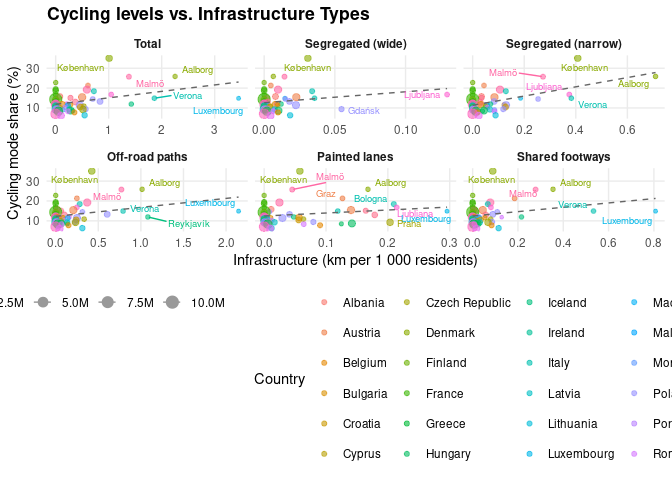

# Preliminary cycling infra vs usage analysis


## Introduction

- Aim: examine which cycling-infrastructure metrics align best with
  cycling use.

- Start with simple measures (total km, km per 1 000 people) –
  foundation for later work on network characteristics.

## Data and methods

- Cycling infrastructure from OSM, `osmactive` R package. We classified
  infrastructure into distinct categories using the
  `classify_cycle_infrastructure` function, which considers OSM tags
  (e.g., `highway`, `cycleway`, `segregated`) and geometry (e.g.,
  distance to the nearest road) to distinguish between:

  - **Segregated tracks:** Physically separated from motor traffic
    (further split into wide $\ge$ 2m and narrow \< 2m).
  - **Off-road paths:** Paths away from the road network (e.g., through
    parks).
  - **Painted lanes:** Marked lanes on the carriageway without physical
    separation.
  - **Shared footways:** Paths shared with pedestrians.
  - **Mixed traffic:** Cycling on the carriageway with motor traffic
    (not counted as dedicated infrastructure).

- Cycling use from [the EU Quality of Life
  Survey](https://ec.europa.eu/regional_policy/information-sources/maps/quality-of-life_en).
  83 cities, ≈ 70,000 respondents; includes a transport question (“On a
  typical day, which mode(s) of transport do you use most often?” ),
  where cycling is one of the selectable modes (up to two choices
  allowed), providing a simple city-level proxy for cycling use. There
  are previous editions.

- Create exploratory scatter plots to see associations.

<!-- ### Potential cycling-use datasets -->

<!-- - **Eurostat: journeys to work by bicycle**   -->

<!--   Patchy coverage, many cities missing.   -->

<!--   https://ec.europa.eu/eurostat/databrowser/view/urb_ctran__custom_18909106/default/table -->

<!-- - **Bicycle counter data (Kraus and Koch, PNAS)**   -->

<!--   Only for cities with counters.   -->

<!--   https://www.pnas.org/doi/10.1073/pnas.2024399118   -->

<!--   Data: https://zenodo.org/records/4015974 -->

<!-- - **Cycling mode share in 864 European cities (Sobral et al.)**   -->

<!--   Interesting working project, modelled values.   -->

<!--   https://www.cyclingandsociety.org/wp-content/uploads/2025/09/CyclingAndSociety2025-4-Sobral.pdf -->

<!-- - **Quality of Life in European Cities survey (DG REGIO)**   -->

<!--   83 cities, >70,000 respondents; includes question   -->

<!--   “On a typical day, which mode(s) do you use most often? Bicycle”.   -->

<!--   https://ec.europa.eu/regional_policy/information-sources/maps/quality-of-life_en -->

<!-- *the QoL survey seems to provide the most consistent city-level cycling-use indicator across many cities. IS 83 sample enough?* -->

``` r
# Test the classification logic on a small country/city (Monaco)
message("Running classification test for Monaco...")
# We use try() to allow the document to render even if the test fails (e.g. internet issues)
test_result <- try({
  get_city_metrics("Monaco", "Monaco")
}, silent = TRUE)

if (inherits(test_result, "try-error")) {
  message("Test failed: ", conditionMessage(attr(test_result, "condition")))
} else {
  print(test_result)
}
```

## Results



    # A tibble: 6 × 3
      infra_type_label    r_squared n_cities
      <fct>                   <dbl>    <int>
    1 Total                   0.147       56
    2 Segregated (wide)       0.04        56
    3 Segregated (narrow)     0.319       56
    4 Off-road paths          0.094       56
    5 Painted lanes           0.041       56
    6 Shared footways         0.081       56

## Next steps

- Check city boundaries and cases with missing or zero cycling
  infrastructure (e.g. Spanish, Irish, and Finish cities).

- Standardise city names in English.

- Address download issues for large countries (Germany and the UK). Also
  Ireland downloading, currently it seems to download Iceland

- Expand the set of simple metrics (e.g. cycling network/area or total
  network).

- Fit basic regression models to examine how different infrastructure
  metrics relate to cycling use.
