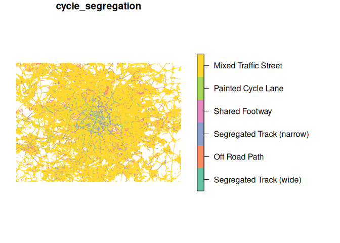

This repo contains reproducible code to support a paper on measuring
cycling network quality.

The aim is to compare different ways of measuring cycle network quality
between major cities and to evaluate these measures against actual
cycling usage data.

The starting point is Paris so we will focus on that city first.

We can put everything in this REAMDE.qmd file for now, and arrange the
repo structure later.

``` r
remotes::install_github("nptscot/osmactive")
library(osmactive)
library(tidyverse)
```

``` r
osm = get_travel_network("Paris")
```

    Reading layer `lines' from data source 
      `/home/robin/data/bronze/osmextract/bbbike_Paris.gpkg' using driver `GPKG'
    Simple feature collection with 780219 features and 68 fields
    Geometry type: LINESTRING
    Dimension:     XY
    Bounding box:  xmin: 1.98 ymin: 48.67 xmax: 2.74 ymax: 49.03
    Geodetic CRS:  WGS 84

``` r
cycle_net = get_cycling_network(osm)
drive_net = get_driving_network(osm)
cycle_net_d = distance_to_road(cycle_net, drive_net)
cycle_net_c = classify_cycle_infrastructure(cycle_net_d, include_mixed_traffic = TRUE)
m = plot_osm_tmap(cycle_net_c)
# m
plot(cycle_net_c["cycle_segregation"])
```



We can calculate a measures of cycle network quality just from this:

``` r
# names(cycle_net_c)
cycle_net_c$length_m = sf::st_length(cycle_net_c)
total_network_length = sum(cycle_net_c$length_m)
city_metrics_1 = cycle_net_c |>
  sf::st_drop_geometry() |>
  # Keep only rows in which cycle_segregation contains "path|track":
  filter(str_detect(cycle_segregation, "ath|rack")) |>
  group_by(cycle_segregation) |>
  summarise(total_length_m = sum(length_m)) |>
  transmute(metric = cycle_segregation, percentage = round(total_length_m / total_network_length * 100))
city_metrics_2 = cycle_net_c |>
  sf::st_drop_geometry() |>
  filter(str_detect(cycle_segregation, "ath|rack")) |>
  group_by(cycle_segregation = "Protected") |>
  summarise(total_length_m = sum(length_m)) |>
  transmute(metric = cycle_segregation, percentage = round(total_length_m / total_network_length * 100))
city_metrics_combined = bind_rows(city_metrics_1, city_metrics_2) |>
  arrange(desc(percentage))
```

The first three metrics for Paris are:

``` r
knitr::kable(city_metrics_combined)
```

| metric                    | percentage |
|:--------------------------|-----------:|
| Protected                 |    8 \[1\] |
| Segregated Track (narrow) |    4 \[1\] |
| Off Road Path             |    3 \[1\] |
| Segregated Track (wide)   |    1 \[1\] |

The next step is to estimate level of service with the following
function:

``` r
osmactive::level_of_service
```

    function (osm) 
    {
        if (!"Speed Limit (mph)" %in% names(osm)) {
            osm = clean_speeds(osm)
            osm$`Speed Limit (mph)` = classify_speeds(osm$maxspeed_clean)
        }
        if (!"AADT" %in% names(osm)) {
            message("Adding AADT column with assumed values based on highway type.")
            osm = estimate_traffic(osm)
            osm$AADT = npt_to_cbd_aadt_numeric(osm$assumed_volume)
            AADT_summary = table(osm$AADT, useNA = "always")
            message("AADT summary: ", paste(names(AADT_summary), 
                AADT_summary, collapse = ", "))
        }
        if (!"infrastructure" %in% names(osm)) {
            osm$infrastructure = osm$cycle_segregation
        }
        names_in_both = intersect(names(osm), names(los_table_complete))
        columns_required = c("AADT", "Speed Limit (mph)", "infrastructure")
        if (length(names_in_both) != 3) {
            message("Names in both columns: ", paste(names_in_both, 
                collapse = ", "))
            message("Columns required: ", paste(columns_required, 
                collapse = ", "))
            stop("Required columns not found in the input data.")
        }
        osm_joined = dplyr::rename(dplyr::left_join(osm, los_table_complete), 
            los = level_of_service)
        osm_joined = dplyr::rename(dplyr::mutate(dplyr::mutate(dplyr::mutate(osm_joined, 
            los = dplyr::case_when(cycle_segregation == "Shared Footway" & 
                is.na(los) ~ 2, cycle_segregation == "Off Road Path" & 
                is.na(los) ~ 3, cycle_segregation == "Segregated Track (wide)" & 
                is.na(los) ~ 3, cycle_segregation == "Segregated Track (narrow)" & 
                is.na(los) ~ 2, TRUE ~ los)), los = dplyr::case_when(cycle_segregation != 
            "Mixed Traffic Street" & los == 0 ~ -1, TRUE ~ los)), 
            los = factor(los, levels = -1:3, labels = rev(c("High", 
                "Medium", "Low", "Should not be used (mixed traffic)", 
                "Should not be used (non-compliant intervention)")), 
                ordered = TRUE), los = forcats::fct_rev(los)), `Level of Service` = los)
        res = sf::st_sf(sf::st_drop_geometry(osm_joined), geometry = sf::st_geometry(osm_joined))
        res
    }
    <bytecode: 0x61800d62ef10>
    <environment: namespace:osmactive>
