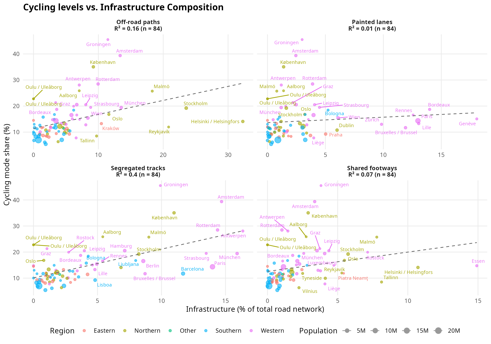

```{r}
#| label: source-scripts
#| include: false

source("R/00_setup.R")
source("R/01_qol_proxy.R")
source("R/02_city_boundaries.R")
source("R/03_city_metrics.R")
source("R/04_build_city_metrics.R")
source("R/05_build_final_city_dataset.R")
source("R/06_plots.R")
source("R/07_models.R")
```

## Introduction

- Cycling is widely promoted in European cities to improve public health, reduce emissions, and enhance urban liveability.

- Infrastructure provision is commonly assumed to be a key determinant of cycling uptake.

- However, not all types of cycling infrastructure offer the same level of protection, comfort, or perceived safety.

- Much of the existing evidence relies on single-city case studies or intervention-based evaluations.

- Comparative cross-city analyses that distinguish between infrastructure types remain limited.

- Infrastructure is often measured in aggregate terms, without differentiating between facility composition and quality.

- A harmonised, multi-city assessment can help clarify which physical infrastructure metrics are most strongly associated with cycling levels.

- This is particularly relevant for policy, as cities must decide not only how much infrastructure to build, but what kind.

- **Aim**: This study examines how the amount and composition of cycling infrastructure are associated with cycling levels across 83 European cities. 

## Data and methods

### Data sources

We combine three data sources: (i) survey-based cycling use, (ii) city boundaries, and (iii) cycling infrastructure derived from OpenStreetMap (OSM).

### Cycling use

Cycling use is measured using the EU Quality of Life Survey (83 cities; approximately 70,000 respondents), which includes the question: *"On a typical day, which mode(s) of transport do you use most often?"* Respondents can select up to two modes. Cycling is one of the available options, allowing us to derive a city-level proxy for cycling prevalence.

For each city, we compute the percentage of respondents reporting cycling as one of their main modes of transport. This aggregated measure is used as the dependent variable in the analysis.

### City boundaries

To ensure comparability across cities, we explored the use of standardised urban boundaries. Administrative boundaries retrieved from OpenStreetMap can vary in geographic extent, potentially affecting infrastructure measures.

Alternative approaches such as the Degree of Urbanisation (DEGURBA), implemented in R packages such as `flexurba` and `giscoR`, allow cities to be defined based on population density thresholds (e.g. Urban Centres or Functional Urban Areas). In this preliminary analysis, we rely on administrative boundaries, but apply a clipping heuristic for very large cities (>1000 km²), using a 25 km buffer around the city centroid to limit spatial extent.

### Cycling infrastructure

Cycling infrastructure data were extracted from OpenStreetMap using the `osmactive` R package. The full transport network was retrieved and filtered to obtain cycling-related infrastructure.

Infrastructure was classified into distinct categories using the `classify_cycle_infrastructure()` function, which combines OSM tags (e.g. `highway`, `cycleway`, `segregated`) with geometric information (e.g. distance to the nearest road). This allows distinguishing between:

- **Segregated tracks**: physically separated from motor traffic (further divided into wide $\geq$ 2 m and narrow < 2 m)
- **Off-road paths**: routes away from the road network (e.g. parks, greenways)
- **Painted lanes**: marked lanes on the carriageway without physical separation
- **Shared footways**: infrastructure shared with pedestrians

### Variable construction

Cycling use is aggregated at the city level to match the spatial scale of infrastructure variables.

The main independent variables capture both the **amount** and **composition** of cycling infrastructure:

- **Total provision** is measured as kilometres of cycling infrastructure per 1,000 inhabitants (`cycle_km_per_1000`).
- **Infrastructure composition** is measured as the share of the total road network corresponding to each infrastructure type (e.g. `segregated_pct_network`, `painted_pct_network`).

Total road length is derived from the OSM road network and used to normalise infrastructure measures across cities.

All variables are constructed to ensure comparability across cities of different sizes.

In addition, models include **regional fixed effects** (Northern, Southern, Western, and Other Europe) to account for broad geographic and contextual differences across cities.

Population density was explored as an additional control variable, but results were not sensitive to its inclusion.

### Statistical analysis

We first conduct a descriptive analysis, including summary statistics and scatter plots, to explore bivariate relationships between cycling levels and different infrastructure measures.

We then estimate a series of linear regression models to examine the association between cycling infrastructure and cycling levels.

Three model specifications are considered:

1. **Total provision model**, including only overall infrastructure provision
2. **Infrastructure type model**, including shares of different infrastructure types
3. **Combined model**, including both total provision and key infrastructure types, alongside regional controls

To assess robustness, we estimate additional specifications excluding influential observations (based on Cook's distance), including population density, and using a log-transformed dependent variable.

All models are estimated using ordinary least squares (OLS), and standard diagnostic checks (e.g. multicollinearity and influential observations) are performed.

## Results

### Descriptive statistics

Table X presents descriptive statistics for the main variables used in the analysis.

```{r}
#| echo: false
library(dplyr)
library(psych)
library(knitr)

#| echo: false
final_city_model_data |>
  select(
    "Cycling mode share (%)" = bike_share_pct,
    "Cycle km per 1000 people" = cycle_km_per_1000,
    "Segregated (%)" = segregated_pct_network,
    "Painted (%)" = painted_pct_network,
    "Off-road (%)" = off_road_pct_network,
    "Shared (%)" = shared_pct_network,
    "Population density" = density
  ) |>
  psych::describe() |>
  select(n, mean, sd, min, max) |>
  kable(digits = 2, caption = "Descriptive statistics")

names(final_city_model_data)
```

Cycling levels vary substantially across cities, ranging from around 5% to over 45%.

Table X illustrates the range of cycling levels across selected cities.

```{r}
#| label: tbl-qol-cities
#| echo: false
top_3 <- qol_q5 |> head(3)
bottom_3 <- qol_q5 |> tail(3)
middle_rows_indices = 4:(nrow(qol_q5) - 3)
middle_rows <- qol_q5[middle_rows_indices, ]
set.seed(42)
middle_3 <- middle_rows |>
  ungroup() |>
  sample_n(3)

bind_rows(top_3, middle_3, bottom_3) |>
  arrange(desc(bike_prop)) |>
  mutate(bike_prop = scales::percent(bike_prop, accuracy = 0.1)) |>
  select(country, city_name, bike_prop, sample_size = total_sample) |>
  knitr::kable(caption = "Top 3, bottom 3 and 3 random middle cities by cycling levels")
```

```{r}
#| label: fig-scatter-plot
#| fig-cap: "Scatter plots showing the relationship between cycling mode share and different types of cycling infrastructure (as a percentage of the total road network), colored by European region."

```

```{r}
#| label: analysis-standardized
#| include: false

standard_analysis <- NULL
cor_standard <- NA_real_

if (file.exists("outputs/city_lengths_standardized.csv")) {
  standard_analysis <- readr::read_csv("outputs/city_lengths_standardized.csv", show_col_types = FALSE) |>
    dplyr::left_join(qol_q5, by = c("country", "city_name")) |>
    dplyr::mutate(
      bike_share_pct = bike_prop * 100,
      pct_segregated = (segregated_km / total_road_km) * 100
    )

  cor_standard <- stats::cor(
    standard_analysis$pct_segregated,
    standard_analysis$bike_share_pct,
    use = "complete.obs"
  )^2
}

n_standard <- if (is.null(standard_analysis)) NA_integer_ else nrow(standard_analysis)

```

<!-- The analysis reveals varying degrees of association between infrastructure types and cycling levels when normalized by the total road network. -->

```{r}
#| label: tbl-correlations
#| eval: false
#| include: false
#| tbl-cap: Correlation between different cycling infrastructure measures and cycling mode share.
cor_data |>
  filter(!str_detect(infra_type_label, "LoS")) |>
  arrange(desc(correlation)) |>
  transmute(
    Metric = infra_type_label,
    `Cities (n)` = n_cities,
    `Correlation (r)` = round(correlation, 3),
    `R-squared` = round(r_squared, 3)
  ) |>
  knitr::kable()
```

Segregated infrastructure shows a strong positive association with cycling levels (r = 0.63), while painted lanes show little to no relationship.

<!-- Surprisingly, the **Low Stress (High/Med LoS)** network shows a weak negative correlation ($r = `r r_vals["Low Stress (High/Med LoS)"]`$). This suggests that a high proportion of low-traffic residential streets does not automatically lead to high cycling levels. In many cases, cities with very high percentages of "low stress" streets are lower-density urban areas where these streets lack the connectivity or dedicated infrastructure on major corridors needed to make cycling a viable transport option across the city. -->

### Statistical analysis

Across all model specifications, both the amount and type of cycling infrastructure are associated with cycling levels. Higher infrastructure provision is consistently linked to higher cycling mode share, with an increase of around 3–5 percentage points per additional kilometre per 1,000 inhabitants. The share of segregated infrastructure shows a strong and robust positive association across all models, while painted infrastructure shows no consistent relationship and is negative in some specifications.

Regional differences are observed, with cities in Western Europe showing higher cycling levels compared to the reference category. Including population density does not materially change the results, and findings remain stable when excluding influential observations and when using a log-transformed outcome. Overall, the models explain a substantial share of variation in cycling levels (R² ≈ 0.50–0.55).

```{r}
# summary(m1)
# summary(m2)
# summary(m3)
# summary(m3b)
# summary(m3_log)
```

```{r}
library(modelsummary)

#| echo: false
modelsummary(
  list(
    "Main model" = m3,
    " + density" = m3_density,
    "No influential cities" = m3_robust,
    "Log outcome" = m3_log
  ),
  stars = TRUE
)

```


## Discussion

The results show a clear hierarchy across infrastructure types. Segregated cycling infrastructure is strongly associated with higher cycling levels, while painted lanes show no meaningful association, supporting the hypothesis that physical separation from motor traffic is the single most important infrastructure feature enabling higher cycling levels.

<!-- The findings for the **Low Stress** network are particularly telling. The lack of a positive correlation suggests that merely "reducing bad infrastructure" (i.e., having many quiet streets) is insufficient for driving modal shift. Successful cycling cities are characterized not just by quiet backstreets, but by high-quality, protected interventions on the main road networks where travel demand is highest. -->

In contrast, **painted lanes** show negligible correlation ($R^2 \approx `r round(r2_vals["Painted lanes"], 2)`$), reinforcing the growing consensus that markings without protection are insufficient to encourage significant increases in cycling.

Other facility types, such as **off-road paths** and **shared footways**, display more modest associations with cycling levels. While these facilities may contribute to local connectivity or recreational cycling, they do not exhibit the same strong relationship with city-wide cycling mode share as segregated tracks.

### Limitations

-   **OSM Quality:** The analysis relies on OpenStreetMap data completeness and tagging consistency, which varies by region.
-   **Causality:** This cross-sectional analysis establishes correlation, not causality. High cycling levels might drive investment in infrastructure, or vice versa.
- The analysis is conducted at the city level and does not account for individual-level differences in cycling behaviour.


## Conclusion

Our findings suggest that cities aiming to increase cycling mode share should prioritize the development of **segregated cycling infrastructure**. While paint and shared paths provide connectivity, they do not show the same strong relationship with high cycling usage observed for physically separated tracks. 

Future research should extend this infrastructure-based approach by incorporating network connectivity metrics (e.g., directness, mesh density, network continuity) to assess not only the quantity but also the structural coherence of cycling infrastructure. 

A complementary extension would integrate traffic-stress measures (e.g., Level of Service classifications) to jointly examine infrastructure provision and cycling conditions. 

Finally, multivariate models including urban density, land-use mix, topography, and climate would help disentangle infrastructure effects from broader structural determinants of cycling.

<!-- ### Standardized vs. Administrative Boundaries -->

<!-- Preliminary testing with standardized Urban Centre boundaries (derived from the `giscoR` implementation of DEGURBA/flexurba definitions) for `r nrow(standard_analysis)` cities shows a correlation ($R^2$) for segregated infrastructure of `r round(cor_standard, 2)`. This suggests that the signal is robust across different boundary definitions, though standardized boundaries often yield lower total road lengths by excluding low-density suburban peripheries. -->

<!-- ## Next steps -->

<!-- -   Investigate missing data for France and Spain. -->
<!-- -   Expand metrics to include network connectivity (e.g., mesh density, directness). -->
<!-- -   Fit multivariate regression models including controls. -->